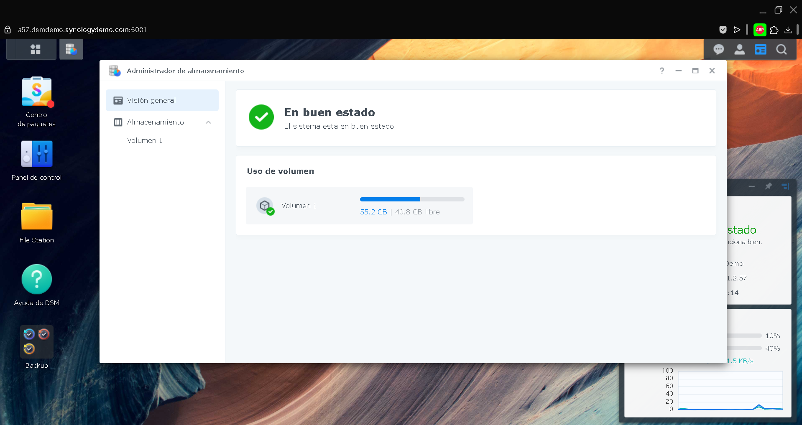
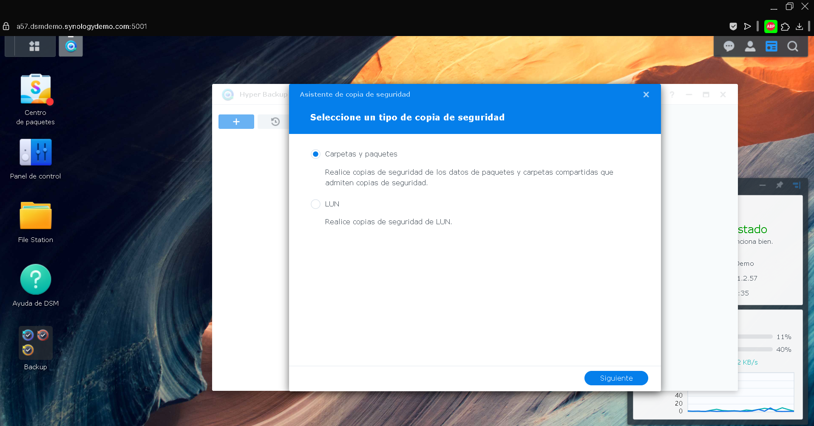
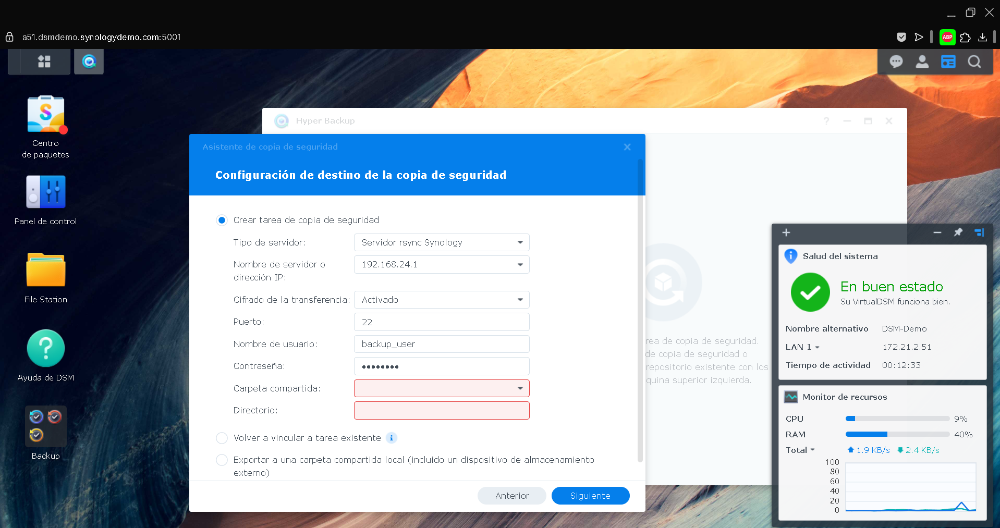

## 1. Arquitectura General del Sistema  
  
- **Nivel 1:** PC-Windows y FreeFileSync - PC-MacOS y FreeFileSync - PC-Linux y FreeFileSync
- **Nivel 2:** NAS
- **Nivel 3:** PC-Remoto


En el primer nivel, tenemos 3 host con sistemas operativos diferentes. Hemos optado por usar para los Backups FreeFileSync, que es un programa gratuito y open source, ya que podemos usarlo sin problema en los 3 sistemas operativos y pensamos que su gestión y mantenimiento nos ahorrarían trabajo y haría un ecosistema mucho mas limpio. También nos permite hacer los Backups directamente a otra ubicación de la red.

En el segundo nivel, tenemos un servidor NAS en donde se harán directamente las copias de seguridad de los equipos del primer nivel. El NAS almacenará y gestionará las copias de seguridad con Script y las enviará a un segundo servidor, que en este caso sera un PC-Remoto.

En el tercer nivel, contamos con un PC-Remoto que será quien reciba los Backups del NAS y los almacenará. Lo ideal sería gestionarlo a través de una VPN, lo que le añade una capa extra de seguridad.

_(Explica brevemente la función de cada nivel. Puedes añadir un esquema o diagrama ASCII si lo deseas.)_  
  
---  
  
## 2. Configuración del Nivel 1: PCs Individuales  
  
### a. Selección de software  

Hay decenas de opciones para realizar Backups, tanto en Windows, MacOS y Linux. Por ejemplo, podemos encontrar una herramienta potente a la hora de realizar nuestras copias como lo es **RSync**, que manejaremos por comandos vía terminal, tanto en **Linux**, como en **MacOS**. Podemos encontrar algunas herramientas que son interfaces gráficas, que funcionan para **Rsync**, bajo otro nombre. En **Windows** de forma nativa y vía interfaz, tendríamos a **Robocopy**.

Para esta práctica hemos decidido utilizar **FreeFileSync**, que es una herramienta open source y podemos encontrarla disponible para las 3 plataformas. Por lo que solo sería necesario conocer un programa para gestionar las copias de nuestros 3 host, aunque tengan diferentes sistemas operativos, así quedaría un ecosistema más limpio y accesible.

- **Windows:** FreeFileSync
- **macOS:** FreeFileSync  
- **Linux:** FreeFileSync
  
### b. Programación de copias  
- **¿Cómo se configuran las copias incrementales diarias?** 

Ambos tipos de copias se configuran de una manera similar, pero analicemos primero las copias incrementales y como configurar la automatización de estas. 

En primer lugar debemos configurar el tipo de copia incremental, que puede ser un poquito más lioso a través de **FreeFileSync**. 

## Primer Paso - Instalación

Nos dirigimos a su [página oficial](https://freefilesync.org) 


Si hacemos click en el apartado de **Download** veremos lo que se comentaba al inicio, que encontramos la descarga para los 3 S.O. 

- Podemos ver que hay una edición diferente para donadores y empresas. Estás versiones tienen el añadido de que no hay anuncios en la aplicación y configurando un servidor SMTP tenemos la opción de recibir correos electrónicos (cuando se realicen las copias) y que nos genere informes de nuestras copias. Utilidades extras.

Ahora solo tendríamos que bajar la versión para nuestro sistema e instalarla. 
 


## Segundo Paso - Configuración de las copias

Una vez instalada, veremos la siguiente ventana. Tenemos que fijarnos y distinguir las dos columnas centrales. Configuraremos también la ruta donde se guardarán nuestros logs.


 En la parte izquierda en **examinar** elegiríamos las carpetas de las que queremos realizar nuestra copia de seguridad. Si le damos al **+** verde, podremos añadir más.


Ahora le damos al engranaje verde, donde elegiremos el tipo de copia que vamos a realizar.
En este caso, como queremos realizar las copias incrementales tendremos que elegir la opción de actualizar.


Usará la base de datos para detectar los cambios que hayan y poder realizar las copias. Y bueno, ya tendríamos una parte configurada, la carpeta/s sobre las que queremos hacer nuestras copias incrementales.

Le damos a OK y en la pantalla principal, pulsamos en **Guardar como archivo por lotes...**


Al darle a **Guardar como...** nos pedirá un nombre. Aquí lo guardamos como **"Incrementales.ffs_batch"**


Ya tenemos la configuración para nuestras copias incrementales. Ahora solo habría que automatizarla.

### Windows

**Creamos el Script** para que ejecute nuestro archivo. Lo guardamos como **Incremental.bat**

```batch
@echo off
"C:\Program Files\FreeFileSync\FreeFileSync.exe" "C:\Ruta\Incremental.ffs_batch"
```

Ahora abrimos el programador de tareas (taskschd.msc)

- Crea otra tarea.
- En **Desencadenadores**, elige **Diariamente** (de martes a domingo).
- En **Acciones**, selecciona **Incremental.bat.**
- Y elegimos la hora a la que queremos que se realicen las copias.


### MacOs

**Creamos el Script** para que ejecute nuestro archivo. Lo guardamos como **Incremental_backup.sh**

``` bash
# Copia incremental (martes-domingo)
open -a FreeFileSync --args /Ruta/Incremental.ffs_batch
```

Le damos permisos para poder ejecutar el Script

```bash
chmod +x /Users/tu_usuario/Scripts/Incremental_backup.sh
``` 


Usaremos **Launchd** para programar la tarea.

**Crear el archivo de configuración .plist**

**Nombre del archivo:**  
	`com.user.freesync.incremental.plist`  
(Usamos esta nomenclatura estándar para servicios de usuario)

**Ubicación:**  
	`~/Library/LaunchAgents/`  
(Carpeta obligatoria para servicios de usuario)

**Comando para crearlo:**

```bash
nano ~/Library/LaunchAgents/com.user.freesync.incremental.plist
```

**Contenido del archivo XML**

```XML
<?xml version="1.0" encoding="UTF-8"?>
<!DOCTYPE plist PUBLIC "-//Apple//DTD PLIST 1.0//EN" "http://www.apple.com/DTDs/PropertyList-1.0.dtd">
<plist version="1.0">
<dict>
    <key>Label</key>
    <string>com.user.freesync.incremental</string>
    <key>ProgramArguments</key>
    <array>
        <string>/bin/bash</string>
        <string>/Users/tu_usuario/Scripts/Incremental_backup.sh</string>
    </array>
    <key>StartCalendarInterval</key>
    <array>
        <!-- Martes (2) a las 10 PM -->
        <dict>
            <key>Weekday</key><integer>2</integer>
            <key>Hour</key><integer>22</integer>
            <key>Minute</key><integer>0</integer>
        </dict>
        <!-- Miércoles (3) -->
        <dict>
            <key>Weekday</key><integer>3</integer>
            <key>Hour</key><integer>22</integer>
            <key>Minute</key><integer>0</integer>
        </dict>
        <!-- Jueves (4) -->
        <dict>
            <key>Weekday</key><integer>4</integer>
            <key>Hour</key><integer>22</integer>
            <key>Minute</key><integer>0</integer>
        </dict>
        <!-- Viernes (5) -->
        <dict>
            <key>Weekday</key><integer>5</integer>
            <key>Hour</key><integer>22</integer>
            <key>Minute</key><integer>0</integer>
        </dict>
        <!-- Sábado (6) -->
        <dict>
            <key>Weekday</key><integer>6</integer>
            <key>Hour</key><integer>22</integer>
            <key>Minute</key><integer>0</integer>
        </dict>
        <!-- Domingo (7) -->
        <dict>
            <key>Weekday</key><integer>7</integer>
            <key>Hour</key><integer>22</integer>
            <key>Minute</key><integer>0</integer>
        </dict>
    </array>
    <key>StandardOutPath</key>
    <string>/tmp/freesync_incremental.log</string>
    <key>StandardErrorPath</key>
    <string>/tmp/freesync_incremental_error.log</string>
</dict>
</plist>
```

**Cargar y activar el servicio**

```bash
# Cargar el servicio
launchctl load ~/Library/LaunchAgents/com.user.freesync.incremental.plist

# Verificar estado
launchctl list | grep freesync.incremental
```


### Linux 

**Creamos el Script** para Linux y lo guardamos como **Incremental.sh**

```bash
# Copia incremental (martes-domingo)
FreeFileSync /Ruta/Incremental.ffs_batch
```


Ejecutamos crontab y lo configuramos con la siguiente línea.

```bash
# Copia incremental de martes a domingo a las 10 PM
0 22 * * 2-7 Incremental.sh
```


 
 - **¿Cómo se hacen las copias completas semanales?** 

Para las copias completas el paso será exactamente igual que para las Incrementales. Salvo que en la configuración de la copia, elegiremos el modo **Espejo**.


Ahora guardaremos el archivo por lotes con el nombre de **Completa.ffs_batch** y tendremos que realizar los mismos pasos.

Crear el script que lance el programa y ejecute el archivo de la copia total.

Luego habrá que programarlo de la misma manera para que se ejecute los lunes a las 22:00, de la misma manera.


### c. Destino de las copias  
- **¿Dónde se almacenan?**    
- **¿Cómo se organizan las carpetas por PC?**  


Con **FreeFIleSync** tenemos la ventaja de que, como destino, podemos elegir una carpeta en la red, por lo que la copia directamente la realizaría en el **Servidor Local Primario** (NAS)
que es mucho más práctico y ahorramos tiempo.


Por lo que en el Servidor Local Primario (NAS). Pondría la siguiente estructura. 


---  
  
## 3. Configuración del Nivel 2: Servidor Local Primario  
  
### a. Tipo de hardware elegido  
- Opción: NAS  
- Marca/modelo (si aplica):  Synology DS220+
- Sistema operativo: DSM (DiskStation Manager) 7.2 (simulado en esta ocacion) 
  
### b. Tipo de RAID  
- Elegido: RAID 1 (Espejo)
- Justificación:  

    - Copia duplicada en dos discos. Si uno falla, el otro sigue funcionando.

    - Tiene una  lectura rápida y con buena tolerancia a fallos.

    - Ideal para un entorno doméstico o pequeño profesional donde prioriza la seguridad sobre la capacidad.

- Utilizacion: En este caso se usan 2 discos de 2 TB, por lo que el espacio disponible será de 2 TB efectivos.

###  Proceso de creación de volumen RAID 1 (simulado en DSM)

En esta simulación accedemos a la interfaz DSM del NAS Synology a través de la demo oficial ([https://demo.synology.com](https://demo.synology.com)). Aunque la demo no permite crear nuevos volúmenes, se puede visualizar la herramienta “Administrador de almacenamiento”,donde gestionaremos los discos y volúmenes RAID.




#### Pasos para crear un volumen RAID 1 en DSM:

1. Ir al menú principal > abrir Administrador de almacenamiento.
2. Seleccionar la pestaña volúmenes.
3. Clic en Crear > Crear volumen personalizado.
4. Elegir la opción “Crear un nuevo grupo de almacenamiento”.
5. Seleccionar tipo de RAID: RAID 1.
6. Escoger los discos disponibles.
7. Configurar nombre, sistema de archivos y confirmar.
8. Finalizar para que DSM cree el volumen.


  
### c. Software de gestión  
- Software elegido: Hyper Backup (integrado en DSM)
    
- Función principal: Automatizar y programar copias desde el NAS hacia el servidor remoto (nivel 3) y permitir versiones anteriores, compresión y cifrado.

### Configuración paso a paso de Hyper Backup

Eexplicare el proceso completo para configurar una tarea de copia de seguridad automatizada en el NAS utilizando **Hyper Backup**:

#### 1. Abrir Hyper Backup
Desde el menú principal de DSM, abrir la aplicación **Hyper Backup**.



#### 2. Crear una nueva tarea
- Hacer clic en el botón **"+"** en la parte inferior izquierda.
- Seleccionar **"Copias de seguridad de datos"**.

#### 3. Elegir el destino remoto
- Seleccionar el tipo de destino: Servidor remoto (rsync), dependiendo de lo que soporte el PC remoto.
- Rellenar los datos de conexión:
  - **Dirección IP o dominio** del PC remoto.
  - **Puerto:** 22 si se usa SSH.
  - **Usuario:** backup_user (o el que se haya creado en el servidor remoto).
  - **Ruta destino:** /home/backup_user/nas_copias/.


#### 4. Seleccionar carpetas de origen
- Elegir las carpetas del NAS que se desean respaldar. Por ejemplo:
  - /volume1/backups_pc1/
  - /volume1/backups_pc2/



#### 5. Configurar opciones de la tarea
- **Compresión:** Activado
- **Cifrado:** Activar (establecemos una contraseña)
- **Verificación de integridad:** Programarla semanalmente (Cada domingo)

#### 6. Definir la política de versiones
- Activar la **rotación inteligente de versiones**:
  - Conservar las **3 versiones más recientes**
  - 1 versión por día durante los últimos **7 días**
  - 1 versión por semana durante las últimas **4 semanas**

#### 7. Establecer el horario de copia
- Programar la tarea para ejecutarse **todos los días a las 23:00**
- La copia será **incremental**

#### 8. Configurar alertas por correo electrónico
- En caso de error o finalización correcta, Hyper Backup puede enviar notificaciones por correo si se ha configurado un servidor SMTP en el sistema.

#### 9. Cómo se transfiere al Nivel 3 (Servidor Remoto)
  
- Ruta:
Los datos llegan al servidor remoto mediante protocolo Rsync sobre SSH o SFTP.

- Requisitos previos:

    - El servidor remoto debe tener un usuario con permisos de escritura en la carpeta de destino

    - Tener configurada la conexión VPN entre el NAS y el PC remoto (usando WireGuard, como se describe en el Punto 4)


---  
  
## 4. Configuración del Nivel 3: Servidor Secundario Remoto  
  
### a. Tipo de servidor remoto  

- **Opción elegida:** PC remoto
- **Justificación:** Nadie puede acceder a tu disco duro, solo tu  sabes quien mira, me parece la opción mas segura y es fácil de configurar.  
  
### b. Seguridad de la sincronización  

- **¿Cómo se programa la sincronización?**
Se puede hacer de varias maneras pero la mas óptima será configurarlo con una VPN.  

- **¿Qué cifrado se usa?**  
WireGuard utiliza el cifrado ChaCha20 para cifrar los datos y Poly1305 para autenticarlos.  

- **¿Se puede activar doble autenticación?**  
La VPN solo funciona si tienes el fichero .conf que genera el propio wireguard.  
  
---  
  
## 5. Automatización del Proceso  
  
- **Script de verificación: _(pega o enlaza un ejemplo)_**  
Si usamos bash un ejemplo de script sería  
  
```bash  
#!/bin/bash  
# Script de backup con 7zip  
  
if [ $UID != 0 ]; then  
    echo "[!] Recomendable ejecutar el script con sudo"  
fi  
  
if [ "$#" -lt 2 ]; then  
    echo -e "[-] Debes decirme como minimo dos rutas ten en cuenta que la ultima ruta sera donde se guardara la copia, las otras seran de donde hara los backups\nNO PROPORCIONES RUTAS RELATIVAS"  
    exit 1  
fi  
  
if ! dpkg -s p7zip-full &>/dev/null; then  
    read -p "[?] No tienes el paquete p7zip-full instalado ¿Quieres instalarlo? (S/n)" confirmacion  
    if [[ "$confirmacion" =~ ^[Ss]$ ]]; then  
        sudo apt install 7zip p7zip-full -y < /dev/null 2>&1  
    else  
        echo -e "[-] No se va a istalar"  
    fi  
fi  
  
ruta=${!#}  
if [[ $ruta =~ /$ ]]; then  
    ruta="$(echo ${ruta:0:-1})"  
fi  
  
for i in "$@"; do  
    if [[ ! $i =~ ^/ ]]; then  
        echo -e "[-] No proporciones rutas relativas"  
        exit 1  
    fi  
done  
  
for i in "${@:1:$(($#-1))}"; do  
    nombre_backup="$(basename "$i")_$(date | sed 's/[:\ ]/_/g')"  
    7z a "$ruta/$nombre_backup" "$i" > /dev/null 2>&1  
    if [ $? -eq 0 ]; then  
        echo -e "[+] backup realizado correctamente de $i en $ruta $(date)" >> "$ruta/backup.log"  
    else  
        echo -e "[-] No se ha podido realizar el backup de $i en $ruta $(date)" >> "$ruta/backup.log"  
    fi  
done  
```  

Para que este script sea funcional debemos tener la carpeta del servidor montada en local.  
  
- **Alerta por email: ¿Cómo se configura?**  
Debemos intalar los requerimentos  
  
```bash  
sudo apt update && sudo apt install mailutils postfix -y  
```  
  
Luego configuramos con nuestros parametros de correo en el ficherto /etc/postfix/[main.cf](http://main.cf/)  
  
```bash  
myhostname = [tu-dominio.com](http://tu-dominio.com/)  
mydestination = $myhostname, localhost  
relayhost = [[smtp.tu-proveedor.com](http://smtp.tu-proveedor.com/)]:587  
smtp_use_tls = yes  
smtp_sasl_auth_enable = yes  
smtp_sasl_password_maps = hash:/etc/postfix/sasl_password  
smtp_sasl_security_options = noanonymous  
smtp_tls_CAfile = /etc/ssl/certs/ca-certificates.crt  
```  
  
- **Prueba de restauración: ¿Cada cuánto tiempo? ¿Cómo?**  
En este caso al ser comprimido se puede hacer en /tmp ya que si reiniciamos no se guarda los cambios realizados, y sería bueno hacerlo cada vez que se guarde un backup.  
Esto se puede hacer con un cron que ejecute un script tal que así  
  
```bash  
#!/bin/bash  
   
ultimo=$(ls -1t | head -1)  
ruta=$(echo $(pwd)/$ultimo)  
  
7z x $ruta -o/tmp/  
  
if [ $? -eq 0 ]; then  
         echo "bck realizado correctamente $(date)" >> /var/log/bck.log  
else  
       echo "bck no se ha realizado $(date)" >> /var/log/bck.log  
fi  
```  
  
Ambos scripts son sugerencias mejorables.  
  
---  
## 6. Justificación del uso de RAID  
  
- **¿Por qué no sustituye al backup?**  
En el caso de que recibamos un ciberataque y los discos queden encriptados no hay manera de que nos salve el raid, en cambio el uso de RAID con configuraciones de hotspare es útil para que si falla un disco no se tarde mucho en rehabilitar el sistema.


(El uso de RAID nos da cierta seguridad, según el tipo. Para usarlo en servidores tanto el RAID 5 como el 10, son muy buenas opciones. Nos ofrecen mayores velocidades de lectura y escritura. Tenemos configuraciones de hotspare por si uno de los discos falla, así podremos sustituirlo y nuestros datos seguirán estando intactos.

El problema puede venir más por ciberataques u otro tipo de ataques, como fallos de tensión, fuego... Donde podemos perder toda la información de nuestros discos, ya sea porque se hayan roto o nos hayan cifrado toda la información, por un ramsonware.

En estos casos, los Backups son los únicos que podrían salvarnos. Ya que, como hemos desarrollado en esta tarea, podemos hacer que los backups estén en un servidor distinto, a salvo y protegidos. Con un acceso restringido por VPN.)


- **¿Qué pasa si solo tenemos RAID?**  
Que no tendremos seguridad al 100% en un caso, como ya hemos comentado.  

---  
  
## 7. Resumen de Software Recomendado  
  
| Función                          | Software Recomendado               | Justificación                                                                 |
|----------------------------------|------------------------------------|-------------------------------------------------------------------------------|
| **Gestión centralizada**         | Hyper Backup (Synology)            | Permite configurar tareas automáticas, versiones, cifrado y múltiples destinos. |
| **Sincronización entre servidores** | Rsync / Synology Drive ShareSync   | Rsync permite sincronización por consola; ShareSync es solución visual entre NAS. |
| **Monitorización del sistema**   | Netdata / Zabbix                   | Supervisa rendimiento, red y temperatura de los servidores en tiempo real.     |
| **Copias desde clientes (PCs)**  | FreeFileSync                       | Open source, multiplataforma y configurable como tareas por lotes.             |
| **Alerta por email**             | Postfix + Mailutils                | Sistema de notificación por correo en caso de errores de backup.               |
| **Prueba de restauración**       | 7-Zip + Script bash                | Permite comprobar si los archivos comprimidos pueden restaurarse correctamente. |
| **Seguridad de la sincronización** | WireGuard VPN                      | Cifra todo el tráfico entre el NAS y el servidor remoto mediante claves privadas. |

---  
  
## Bibliografía / Fuentes consultadas  
  
- Fuente 1: Synology - Hyper Backup:  
https://www.synology.com/es-es/dsm/feature/hyper_backup
- Fuente 2: Rsync Documentation:  
https://download.samba.org/pub/rsync/rsync.html
- Fuente 3: FreeFileSync – Official site:  
https://freefilesync.org/
- Fuente 4: WireGuard VPN – Overview and documentation:  
https://www.wireguard.com/
- Fuente 5: Netdata Monitoring Tool:  
https://www.netdata.cloud/
- Fuente 6: Zabbix Network Monitoring:  
https://www.zabbix.com/
- Fuente 7: Mailutils + Postfix SMTP Notifications:  
https://help.ubuntu.com/community/Postfix
- Fuente 8: 7-Zip Command Line Usage:  
https://sevenzip.osdn.jp/chm/cmdline/
- Fuente9: Demostracion en linea Synology NAS:
https://demo.synology.com/es-es/dsm
